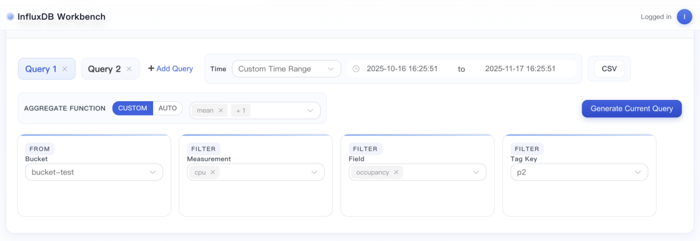
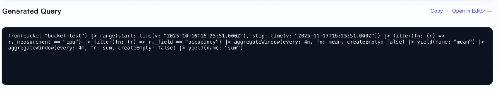

# InfluxDB No-Code Query Builder

A no-code web interface designed to help users build and visualise InfluxDB queries through an interactive frontend, without requiring them to manually write query syntax.

> **Project Context:** This project was completed as part of a university industry project in a team environment. This repository is a portfolio showcase highlighting my individual contributions to the frontend Query Builder and Query Generation functionality.

## 📌 Project Overview

The project aimed to simplify the process of creating and visualising InfluxDB queries.

Instead of manually writing queries, users can interact with a visual interface to select measurements, fields, tags, and other query options. The application then generates the corresponding query based on the user's selections.

The overall system combines a Vue.js frontend with a Python/Flask backend and integrates with InfluxDB and Grafana.

## ✨ Key Features

- Visual interface for building InfluxDB queries
- Dynamic query generation based on user selections
- Measurement, field, and tag selection
- Query preview functionality
- Support for multiple query configurations
- Data visualisation integration
- CSV data export
- Integration with InfluxDB and Grafana

## 👩‍💻 My Contributions

My primary responsibility in this team project was the frontend development of the **Query Builder** and **Query Generation** functionality.

My contributions included:

- Contributed to the development of the visual Query Builder using Vue.js
- Worked on frontend interactions for constructing InfluxDB queries
- Implemented query generation logic based on user-selected measurements, fields, tags, and query options
- Helped connect user selections in the interface with dynamically generated query output
- Participated in testing, debugging, and integration of the query-building functionality
- Collaborated with team members using Git and an Agile development workflow

## 🛠️ Technologies

**Frontend**
- Vue.js
- JavaScript
- HTML
- CSS
- Pinia

**Backend & Data**
- Python
- Flask
- REST APIs
- InfluxDB

**Visualisation**
- Grafana
- ECharts

**Development Tools**
- Git
- GitHub
- VS Code

## 🏗️ System Workflow

A simplified workflow of the query-building functionality:

`User Selection → Query Builder → Query Generation → InfluxDB → Query Results → Visualisation`

For example, users can select measurements, fields, tags, and query options through the frontend. These selections are then used to dynamically construct the corresponding InfluxDB query.

## 📸 Screenshots

### Visual Query Builder

The interface allows users to select query parameters such as bucket, measurement, field, tags, aggregation options, and time range through a visual workflow.

My main contribution focused on the Query Builder interaction and the logic used to transform user selections into generated Flux queries.

### Query Generation

The selected query parameters are converted into Flux query syntax automatically, allowing users to create queries without manually writing Flux.

## 💻 Selected Code Samples

This portfolio repository includes selected code related to my individual contribution to the frontend Query Builder and Query Generation functionality.

### Query Builder
[`QueryBuilder.vue`](src/components/QueryBuilder.vue)

Implements the main Query Builder interface, including query tabs, time-range selection, aggregation configuration, and query generation actions.

### Flux Query Generation
[`queryBuilder.js`](src/stores/queryBuilder.js)

Contains the Pinia state management and dynamic Flux query generation logic that converts user-selected buckets, measurements, fields, tags, time ranges, and aggregation functions into an executable Flux query.

### Query Preview
[`QueryPreview.vue`](src/components/QueryPreview.vue)

Displays the generated Flux query and supports copying and editing the generated query.

## 🎓 What I Learned

Through this project, I gained practical experience in:

- Building interactive frontend functionality with Vue.js
- Translating user interface selections into query-generation logic
- Working with REST APIs and backend services
- Understanding how frontend and backend components interact in a full web application
- Using Git for collaborative software development
- Working as part of an Agile development team

## ℹ️ Note

This was a collaborative university industry project. The original project was developed in a team repository. This portfolio repository focuses specifically on demonstrating my individual contributions and technical learning from the project.
